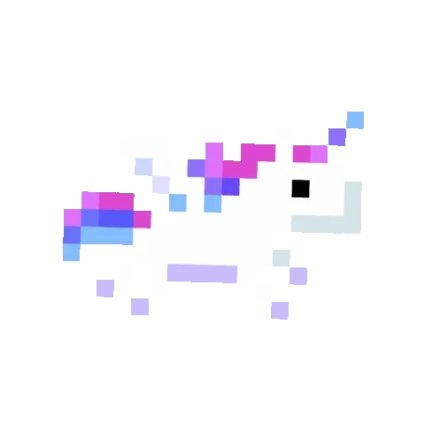
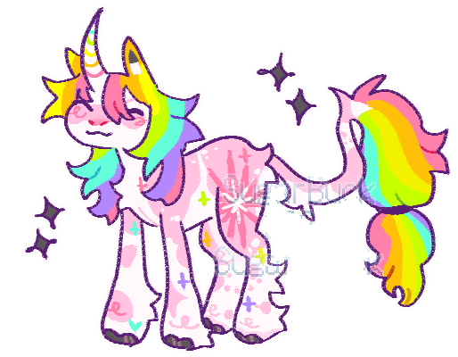
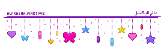
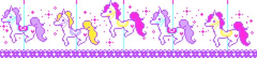

<h1 align="center">
    
</h1>

  <em>
    I try my best to learn new things every day to motivate myself to become <b>a professional software developer</b>.     
   
   <b align="center">"The more you code, the more bugs you encounter."</b> 

 

###  **_About me_**
🏆 On the front-end, I usually work with **ReactJS**, **NextJS**
🏆 On the back-end, I usually work with **_Java_**  and **_Spring Boot_**  , **NestJS**
🌱 I'm currently learning **Message queue: Kafka and RabbitMQ**  
🎉 Next, I'm planning to explore **_Microservice_** , **_ElasticSearch_** , and **_Kubernetes_**  
🏃‍♀️‍➡️ My GPA: 8.3/10.   

###  Contact with me:

  

    	
	
	
	
  

###  Tech stack:

#### Front-end:

&nbsp;
&nbsp;

#### Back-end:

&nbsp;
&nbsp; 

#### Another:

&nbsp;
&nbsp;
&nbsp;
&nbsp;

###  **_My Stats_**

  
  
 

<b>Note:</b> That profile stats above maybe reflect that my experience or skill level has a big problem.
  

      
      

<!--
Specially thank to references:
- Github readme generator: https://rahuldkjain.github.io/gh-profile-readme-generator
- Github icon: https://github.com/tandpfun/skill-icons, https://profile-readme-generator.com/
- Github badges: https://github.com/alexandresanlim/Badges4-README.md-Profile
- Typing svg: https://github.com/DenverCoder1/readme-typing-svg
- Github stats: https://github.com/DenverCoder1/github-readme-streak-stats
-->
